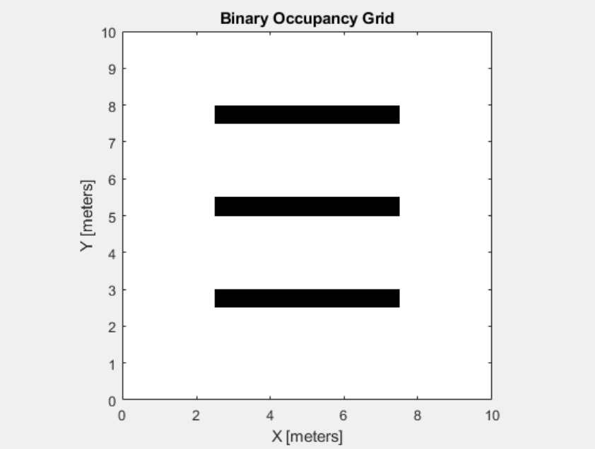
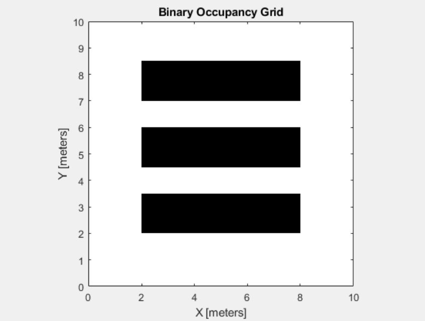

# youBotNavigation

KUKA YouBot navigation using PRM algorithm on MATLAB - CoppeliaSim

## Binary occupancy map and PRM

Binary occupancy map method is used to generate a map of the
scene. The map is created by using the corresponding functions in
MATLAB. 

## Map inflation

After the map is created, mapInflated function is used in order to
inflate the objects in the map. By doing so, a more effective path is
generated. As a result the movement of the robot becomes more reliable.

## Probabilistic roadmap generation

Afterwards by applying the PRM function in MATLAB, the path is generated automatically. 

The waypoint number of the path is counted and the x,y
coordinates of each waypoint is stored in a variable. Also, the velocity
vector for both x,y directions is calculated by subtracting the current
waypoint from the next waypoint. 

## Navigation algorithm

The connection between the MATLAB and CoppeliaSim is established. The current coordinates of the robot 
is obtained from CoppeliaSim using simxGetObjectPosition function.

Then the algorithm first checks the number of waypoints and according to the result it 
executes the commands that is being sent to the robots wheels.

After the waypoint number check, the algorithm checks the x,y
position of the robot and the x,y position of the next waypoint. If the
robot reaches the next waypoint, the velocity vector gets updated so that
the robot starts to move towards the next waypoint.
The velocity vector is updated in x,y velocities.

However in the code, the inverse kinematic calculations are performed. So after the
inverse kinematic calculations are done, the power is sent to wheels
using simxSetJointTargetVelocity function.

Finally, when the robot reaches the final waypoint, the velocity
vector is updated to zero and the power to the wheel actuators are cut.

> remoteApi files are not added which are necessary for the connection of MATLAB and CoppeliaSim 
